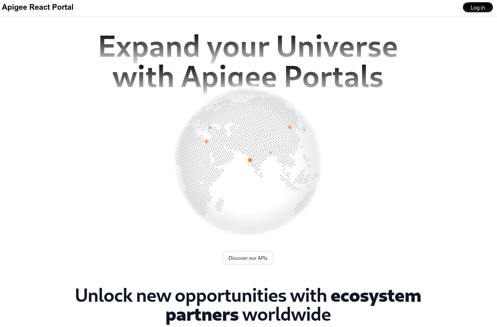

## Apigee React Next.js Sample Portal
This project provides a sample Apigee portal using the [React](https://react.dev/) & [Next.js](https://nextjs.org/) frameworks. It also leverages the [shadcn/ui](https://ui.shadcn.com/) & [Magic UI](https://magicui.design/) react libraries for UI elements.



### Local deployment

```sh
npm install
npm run dev
```

### Deployment to Google Cloud Run

```sh
PROJECT_ID=YOUR_PROJECT_ID
REGION=YOUR_REGION

# make sure your compute user has the rights for cloud build
PROJECTNUMBER=$(gcloud projects describe $PROJECT_ID --format="value(projectNumber)")
gcloud projects add-iam-policy-binding $PROJECT_ID --member="serviceAccount:$PROJECTNUMBER-compute@developer.gserviceaccount.com" --role='roles/storage.objectUser'
gcloud projects add-iam-policy-binding $PROJECT_ID --member="serviceAccount:$PROJECTNUMBER-compute@developer.gserviceaccount.com" --role='roles/artifactregistry.writer'
gcloud projects add-iam-policy-binding $PROJECT_ID --member="serviceAccount:$PROJECTNUMBER-compute@developer.gserviceaccount.com" --role='roles/logging.logWriter'
gcloud projects add-iam-policy-binding $PROJECT_ID --member="serviceAccount:$PROJECTNUMBER-compute@developer.gserviceaccount.com" --role='roles/apihub.viewer'

# build and deploy site to cloud run
gcloud run deploy apigee-react-portal --source . --project $PROJECT_ID --region $REGION --port 3000 --allow-unauthenticated
```